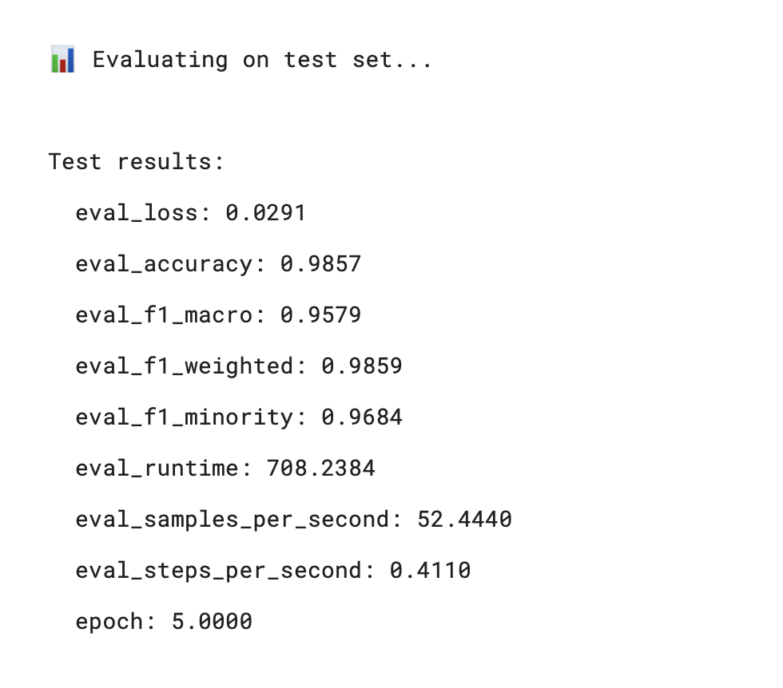
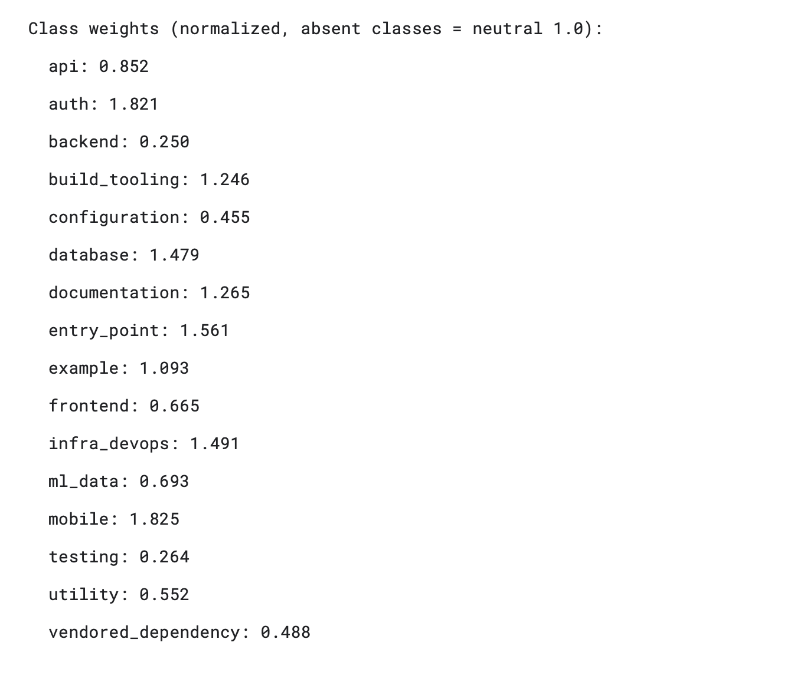

# CodeGraph AI

> **Intelligent repository analysis, code understanding, node classification, and software architecture visualization.**

CodeGraph AI is a software-engineering analysis pipeline that takes a GitHub repository or local codebase and converts it into structured information that can be used to understand the architecture of a software project.

The system combines:

- Repository ingestion and source-code analysis
- AST / Tree-sitter based code analysis
- File, class, function, call, dependency, and data-flow extraction
- Unified graph construction
- ML-based code/file classification
- CodeBERT-based file-level classification
- Graph Neural Network (GraphSAGE) node classification
- Predicted edge generation
- JSON-based intermediate/final outputs
- Next.js-based interactive visualization

The goal is to move from **raw source code → structured graphs → ML predictions → understandable software architecture**.

---

## System Overview

```text
                         ┌──────────────────────┐
                         │   GitHub Repository  │
                         │     / Local Repo     │
                         └──────────┬───────────┘
                                    │
                                    ▼
                         ┌──────────────────────┐
                         │ Repository Loader    │
                         │ + Source Extraction  │
                         └──────────┬───────────┘
                                    │
                                    ▼
              ┌─────────────────────────────────────────┐
              │          Code Analysis Layer            │
              │                                         │
              │ AST / Tree-sitter / Imports / Calls     │
              │ Classes / Functions / Data Flow         │
              └────────────────────┬────────────────────┘
                                   │
                                   ▼
                     ┌──────────────────────────┐
                     │   Unified Code Graph     │
                     │                          │
                     │ Nodes + Edges + Features │
                     └────────────┬─────────────┘
                                  │
                    ┌─────────────┴─────────────┐
                    ▼                           ▼
          ┌──────────────────┐         ┌──────────────────┐
          │ CodeBERT         │         │ GraphSAGE / GNN  │
          │ File Classifier  │         │ Node Classifier  │
          └────────┬─────────┘         └────────┬─────────┘
                   │                            │
                   └────────────┬───────────────┘
                                ▼
                     ┌──────────────────────────┐
                     │ Final Predictions        │
                     │ + Predicted Edges        │
                     └────────────┬─────────────┘
                                  │
                                  ▼
                     ┌──────────────────────────┐
                     │       Next.js UI         │
                     │                          │
                     │ Graph / Architecture     │
                     │ File Flow / Exploration  │
                     └──────────────────────────┘
```

---

## Key Features

### 1. Repository Analysis

The pipeline accepts repository URLs and analyzes supported source files.

Example:

```bash
python master_main.py
```

A repository is cloned into a temporary location or loaded from the configured cache, analyzed, and then removed when temporary cloning is used.

The analysis pipeline records information such as:

- File paths
- Programming languages
- Classes
- Functions
- Imports
- Calls
- Dependencies
- Data-flow relationships
- Repository structure

---

### 2. Multi-Level Code Understanding

CodeGraph AI is designed to understand software at several levels:

```text
Repository
   │
   ├── Files
   │    ├── Classes
   │    ├── Functions
   │    └── Variables / Data
   │
   ├── Imports / Dependencies
   │
   ├── Function Calls
   │
   └── Data Flow
```

These relationships can be represented as graphs and later consumed by visualization or machine-learning components.

---

## Machine Learning Components

### CodeBERT File Classification

The CodeBERT component performs file-level classification.

The prediction schema contains:

```json
{
  "filepath": "...",
  "repo_url": "...",
  "predicted_label": "...",
  "confidence": 0.98,
  "is_confident": true,
  "all_labels": []
}
```

The classifier is intended to infer the architectural/functional role of source files.

### Graph Neural Network

The graph component uses node features and graph relationships for node classification.

The GNN pipeline uses graph structure such as:

- In-degree
- Out-degree
- Total degree
- PageRank
- Betweenness
- Closeness
- Clustering
- Import relationships
- Call relationships
- Definition relationships
- Other graph edge statistics

The architecture uses GraphSAGE-style message passing to learn node representations from both node features and graph connectivity.

---

## Label Taxonomy

The current 16-class taxonomy is:

| Label | Description |
|---|---|
| `api` | API and interface-related code |
| `auth` | Authentication and authorization |
| `backend` | Backend/business/server-side code |
| `build_tooling` | Build systems and development tooling |
| `configuration` | Configuration and environment definitions |
| `database` | Database and persistence-related code |
| `documentation` | Documentation and project guides |
| `entry_point` | Application/CLI/service entry points |
| `example` | Example/demo code |
| `frontend` | Frontend/UI code |
| `infra_devops` | Infrastructure, deployment, and DevOps |
| `ml_data` | Machine learning and data-processing code |
| `mobile` | Mobile application code |
| `testing` | Tests and testing infrastructure |
| `utility` | General-purpose helper/utility code |
| `vendored_dependency` | Vendored or bundled dependencies |

---

# Model Evaluation

The current test-set evaluation shown in the project results is:

| Metric | Score |
|---|---:|
| Test loss | **0.0291** |
| Accuracy | **98.57%** |
| Macro F1 | **95.79%** |
| Weighted F1 | **98.59%** |
| Minority F1 | **96.84%** |
| Evaluation runtime | **708.2384 s** |
| Samples / second | **52.4440** |
| Epoch | **5** |

### Test Results



---

## Per-Class Performance

| Class | Precision | Recall | F1 | Support |
|---|---:|---:|---:|---:|
| `api` | 0.964 | 0.998 | 0.981 | 1190 |
| `auth` | 0.859 | 0.948 | 0.902 | 174 |
| `backend` | 0.992 | 0.972 | 0.982 | 8637 |
| `build_tooling` | 0.988 | 0.982 | 0.985 | 570 |
| `configuration` | 0.989 | 0.995 | 0.992 | 5798 |
| `database` | 0.701 | 0.896 | 0.787 | 183 |
| `documentation` | 0.966 | 0.982 | 0.974 | 114 |
| `entry_point` | 0.819 | 0.974 | 0.890 | 195 |
| `example` | 0.994 | 1.000 | 0.997 | 862 |
| `frontend` | 0.944 | 0.991 | 0.967 | 632 |
| `infra_devops` | 0.960 | 0.992 | 0.976 | 528 |
| `ml_data` | 0.968 | 0.996 | 0.982 | 2012 |
| `mobile` | 0.993 | 0.916 | 0.953 | 956 |
| `testing` | 1.000 | 1.000 | 1.000 | 6092 |
| `utility` | 0.976 | 0.947 | 0.961 | 2154 |
| `vendored_dependency` | 0.997 | 1.000 | 0.998 | 7046 |


### Interpretation

The model performs strongly across most classes. The main weaker class in the displayed results is `database`, with an F1-score of **0.787**, followed by `entry_point` at **0.890** and `auth` at **0.902**.

These classes have relatively small support compared with dominant classes such as `backend`, `testing`, and `vendored_dependency`, so their performance should be monitored carefully when evaluating new repositories.

---

# Class Imbalance Handling

The training pipeline uses normalized class weights.

Current displayed class weights:

| Class | Weight |
|---|---:|
| `api` | 0.852 |
| `auth` | 1.821 |
| `backend` | 0.250 |
| `build_tooling` | 1.246 |
| `configuration` | 0.455 |
| `database` | 1.479 |
| `documentation` | 1.265 |
| `entry_point` | 1.561 |
| `example` | 1.093 |
| `frontend` | 0.665 |
| `infra_devops` | 1.491 |
| `ml_data` | 0.693 |
| `mobile` | 1.825 |
| `testing` | 0.264 |
| `utility` | 0.552 |
| `vendored_dependency` | 0.488 |



Higher weights are assigned to relatively underrepresented classes so that their classification errors have a larger influence during training.

---

# Output Files

The pipeline produces structured JSON artifacts that can be consumed by the visualization layer.

Typical outputs include:

```text
Final_Output/
├── output_predicted_edges.json
└── Prediction_<repo>_codebert.json
```

Repository analysis also produces:

```text
data/
└── output.json
```

The JSON-first architecture makes the Python analysis layer independent from the frontend.

---

# Next.js Visualization

The frontend is implemented using Next.js.

The intended data flow is:

```text
Python Pipeline
      │
      ▼
Final_Output/*.json
      │
      ▼
Next.js API Route
      │
      ▼
React Components
      │
      ├── File Flow Explorer
      ├── Graph Visualization
      ├── Architecture View
      └── Code Exploration
```

For local development:

```bash
cd code-graph
npm run dev
```

Then open:

```text
http://localhost:3000
```

The Next.js server can read the generated JSON files from the parent `Combine/Final_Output` directory through a server-side API route.

---

# Project Structure

A simplified project layout:

```text
Combine/
│
├── code-graph/                  # Next.js visualization frontend
│   ├── app/
│   ├── components/
│   └── package.json
│
├── codegraph/                   # Repository/code analysis engine
│
├── data/                        # Intermediate analysis data
│   └── output.json
│
├── Final_Output/                # Final ML/graph outputs
│   ├── output_predicted_edges.json
│   └── Prediction_*.json
│
├── Label_Classification/        # CodeBERT classification
│
├── Node_Classification/         # GNN node classification
│
├── data_cache/                  # Cached analysis data
│
├── master_main.py               # Main pipeline orchestrator
│
├── json_filter.py               # JSON filtering/processing
│
└── venv/                        # Python environment
```

---

# End-to-End Pipeline

The complete workflow is:

### Step 1 — Select a repository

```text
GitHub URL
   ↓
Repository Loader
```

### Step 2 — Load source files

Supported files are discovered and loaded while irrelevant directories/files are skipped.

### Step 3 — Analyze source code

The analysis layer extracts:

```text
Files
Classes
Functions
Imports
Calls
Dependencies
Data Flow
```

### Step 4 — Build graph representation

The extracted information is transformed into graph nodes and edges.

### Step 5 — Classify code

Two complementary approaches are used:

```text
Source/File Information ──→ CodeBERT
Graph Structure + Features ──→ GraphSAGE
```

### Step 6 — Generate predictions

The predictions are combined with graph information to generate final machine-readable artifacts.

### Step 7 — Visualize

Next.js consumes the JSON output and presents the software architecture interactively.

---

# Why This Architecture?

Traditional repository browsers expose a folder tree:

```text
project/
├── src/
├── tests/
├── utils/
└── config/
```

That is useful for navigation, but it does not directly explain:

- Which components depend on each other
- Which files call other files
- How data moves through the system
- Which files belong to frontend/backend/API/database layers
- Which components are central to the architecture

CodeGraph AI attempts to convert this information into a machine-readable and visual representation.

```text
Folder Tree
     +
Code Structure
     +
Dependencies
     +
Calls
     +
Data Flow
     +
ML Predictions
     ↓
Software Architecture Graph
```

---

# Technology Stack

## Backend / Analysis

- Python
- AST-based analysis
- Tree-sitter
- NetworkX
- PyTorch / PyTorch Geometric
- GraphSAGE
- Transformers / CodeBERT
- JSON-based data exchange

## Frontend

- Next.js
- React
- TypeScript
- ReactFlow / graph visualization components
- D3-based visualization where applicable

## Development

- Git
- GitHub
- Python virtual environments
- Node.js / npm

---

# Example Usage

### Run the Python pipeline

```bash
source venv/bin/activate
python master_main.py
```

### Start the visualization

```bash
cd code-graph
npm run dev
```

Open:

```text
http://localhost:3000
```

---

# Model Performance Summary

The current reported test results show:

```text
Accuracy       : 98.57%
Macro F1       : 95.79%
Weighted F1    : 98.59%
Minority F1    : 96.84%
Test Loss      : 0.0291
```

The high macro and minority F1 scores indicate that the model is not relying only on the largest classes; however, individual classes such as `database`, `entry_point`, and `auth` remain areas where additional data or improved feature separation could be useful.

---

# Future Improvements

Potential next steps for CodeGraph AI include:

- Better handling of minority architectural classes
- Improved database/API/auth disambiguation
- Cross-repository generalization evaluation
- More programming-language support
- More precise data-flow extraction
- Function-level and class-level semantic embeddings
- Hierarchical architecture detection
- Community detection and clustering
- Strongly connected component analysis
- Automatic architectural layer detection
- Interactive node explanations
- Click-to-explain source code
- Repository comparison
- Incremental analysis for large repositories
- Scalable graph processing for very large codebases

---

# Project Vision

CodeGraph AI aims to become an **AI-assisted software architecture explorer**.

Instead of asking a developer to understand thousands of files manually:

```text
10,000+ files
      ↓
CodeGraph AI
      ↓
Architecture
Dependencies
Data Flow
Calls
Component Roles
ML Predictions
      ↓
Interactive Understanding
```

The long-term goal is to make a large unfamiliar codebase understandable from the **architecture level down to individual source files and functions**.

---

## License

Add the project's license here, for example:

```text
MIT License
```

if the repository is intended to be released under MIT.
