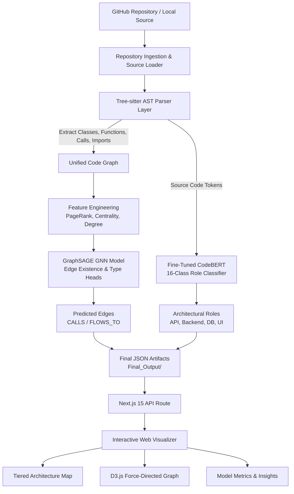
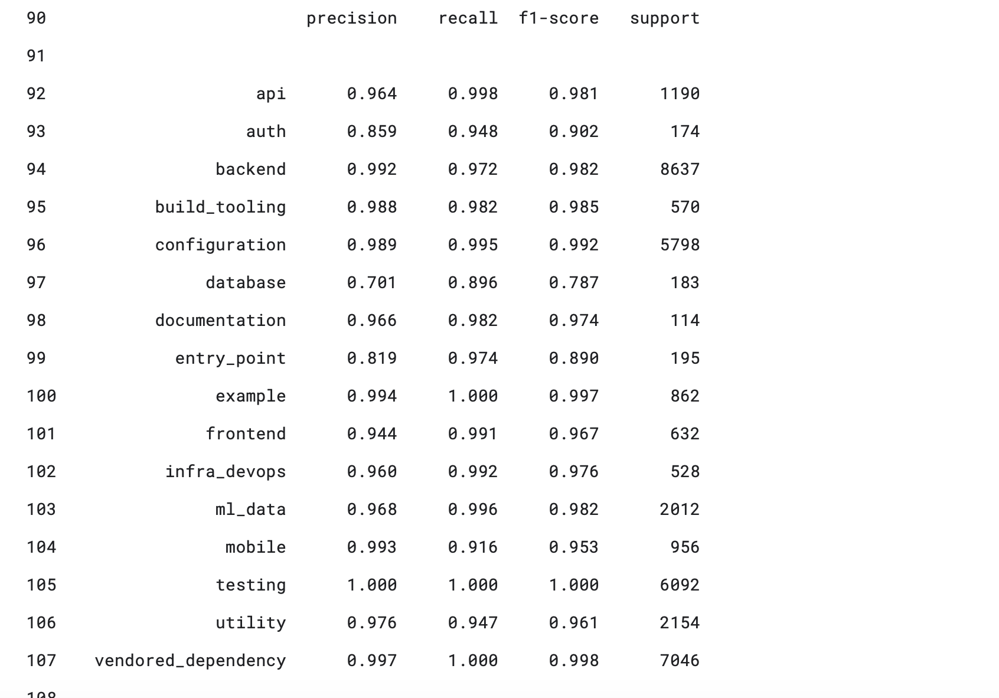

# CodeGraph AI ⚡

<p align="center">
  <strong>Intelligent Repository Analysis, Graph Neural Network Edge Prediction, and Software Architecture Visualization</strong>
</p>

<p align="center">
  
  
  
  
  
  
  
</p>

---

## 📌 Executive Summary

Modern software codebases often contain thousands of files with complex, undocumented dependencies across tiers. Traditional folder trees fail to communicate **how data actually flows**, **which modules call which functions**, or **where architectural boundaries lie**.

**CodeGraph AI** solves this by converting raw codebases into structured, multi-dimensional knowledge graphs:
1. **Tree-sitter AST Grammars** parse source files (Python, TypeScript, JavaScript, Java) to extract imports, definitions, function calls, and data flows.
2. **Graph Neural Networks (GraphSAGE)** predict latent and undiscovered cross-module relationships and dataflow edges.
3. **Fine-Tuned CodeBERT Transformer** classifies each source file into an architectural taxonomy of 16 distinct roles (e.g., `api`, `backend`, `database`, `auth`, `ml_data`, `frontend`).
4. **Interactive Next.js & D3.js Web Platform** renders multi-level architecture maps, force-directed dependency simulations, and real-time model analytics.

---

## 🌟 Key Features

- 🌲 **Multi-Language AST Analysis**: Precise semantic extraction without executing untrusted code using Tree-sitter.
- 🧠 **Graph Neural Network (GraphSAGE)**: Inductive edge-prediction head trained on graph topology (PageRank, betweenness, clustering, degree centrality) to discover cross-file dataflow.
- 🏷️ **16-Class CodeBERT Role Classification**: Transformer-based model achieving **98.57% test accuracy** and **95.79% Macro F1**.
- 🌐 **Tiered Architectural Map**: Visualizes flow between Frontend ➔ API ➔ Backend ➔ Database ➔ DevOps layers.
- 🕸️ **Dynamic D3 Force Graph**: Real-time physics simulation with module clustering, degree centrality scaling, and instant file search.
- 📊 **Model Insights Dashboard**: Interactive breakdown of classification metrics, per-class F1 performance, and class weights.
- 🚀 **Zero-Config Instant Demo**: Runs out of the box with bundled pre-computed repository graphs.

---

## 🏗️ System Architecture



---

## 📊 Empirical Model Evaluation

The machine learning pipeline was trained and evaluated on diverse open-source codebases with heavy class imbalance mitigation.

### Benchmark Metrics

| Metric | Score | Note |
|---|---:|---|
| **Test Accuracy** | **98.57%** | Evaluated across 37,429 held-out source files |
| **Macro F1** | **95.79%** | Unweighted mean across all 16 architectural classes |
| **Weighted F1** | **98.59%** | Weighted by class support |
| **Minority F1** | **96.84%** | Evaluated on rare classes (auth, database, entry_point) |
| **Test Loss** | **0.0291** | Cross-entropy with normalized class weights |
| **Throughput** | **52.4 samples/s** | Inference throughput on GPU |

### Evaluation Visualizations

<p align="center">
  
  
</p>

### Class Imbalance Handling
To prevent the model from biasing toward dominant classes (`backend`, `testing`, `vendored_dependency`), inverse class frequency weights were computed and applied to the loss function:

<p align="center">
  
</p>

---

## 🏷️ 16-Class Architectural Taxonomy

| Label | Functional Role | Precision | Recall | F1 Score | Support |
|---|---|---:|---:|---:|---:|
| `backend` | Server logic, runtime services, orchestration | 0.992 | 0.972 | **0.982** | 8,637 |
| `vendored_dependency` | Third-party vendor code & bundled libraries | 0.997 | 1.000 | **0.998** | 7,046 |
| `testing` | Unit tests, integration suites, test fixtures | 1.000 | 1.000 | **1.000** | 6,092 |
| `configuration` | Config files, environment schemas, manifests | 0.989 | 0.995 | **0.992** | 5,798 |
| `utility` | Helper functions, shared formatters, math utils | 0.976 | 0.947 | **0.961** | 2,154 |
| `ml_data` | Machine learning models, pipelines, ETL scripts | 0.968 | 0.996 | **0.982** | 2,012 |
| `api` | Endpoints, HTTP handlers, routes, controllers | 0.964 | 0.998 | **0.981** | 1,190 |
| `mobile` | Mobile views, iOS/Android platform drivers | 0.993 | 0.916 | **0.953** | 956 |
| `example` | Demo apps, sample snippets, tutorials | 0.994 | 1.000 | **0.997** | 862 |
| `frontend` | Client UI components, templates, styling | 0.944 | 0.991 | **0.967** | 632 |
| `build_tooling` | Compilers, linters, bundlers, CI runners | 0.988 | 0.982 | **0.985** | 570 |
| `infra_devops` | Dockerfiles, Kubernetes manifests, Terraform | 0.960 | 0.992 | **0.976** | 528 |
| `entry_point` | Application entry scripts (`main.py`, CLI commands) | 0.819 | 0.974 | **0.890** | 195 |
| `database` | ORM entities, SQL migrations, schemas | 0.701 | 0.896 | **0.787** | 183 |
| `auth` | OAuth, JWT, sessions, password hashing | 0.859 | 0.948 | **0.902** | 174 |
| `documentation` | Guides, changelogs, architecture markdown | 0.966 | 0.982 | **0.974** | 114 |

---

## 🚀 Quick Start Guide

### Option 1: Instant Web Visualization (No ML Setup Required)
You can launch the Next.js visualizer immediately with pre-computed graph data:

```bash
# Clone the repository
git clone https://github.com/ankush0545/code_visualise.git
cd code_visualise/code-graph

# Install frontend dependencies and start dev server
npm install
npm run dev
```
Open **[http://localhost:3000](http://localhost:3000)** in your browser.

---

### Option 2: Full End-to-End Analysis Pipeline

To analyze any arbitrary GitHub repository or local codebase from scratch:

```bash
# 1. Set up Python virtual environment
python3 -m venv venv
source venv/bin/activate  # Windows: venv\Scripts\activate
pip install -r requirements.txt

# 2. Run master orchestrator on target repository
python master_main.py https://github.com/Netflix/metaflow
```

The script will automatically:
1. Ingest the repository and extract Tree-sitter AST graphs.
2. Run GraphSAGE GNN to infer latent dataflow edges (`top-k: 1000`).
3. Classify file roles using CodeBERT.
4. Launch the Next.js visualization dashboard.

---

### Option 3: Docker Deployment

Run the complete application inside a standardized container:

```bash
docker build -t codegraph-ai .
docker run -p 3000:3000 codegraph-ai
```
Then visit [http://localhost:3000](http://localhost:3000).

---

## 📁 Repository Layout

```text
code_visualise/
├── assets/                       # Evaluation plots & benchmark charts
│   ├── class_weights.png
│   ├── per_class_metrics.png
│   └── test_results.png
│
├── codegraph/                    # Core AST & Dependency Extraction
│   ├── treesitter_analyzers/     # Language AST grammar parsers
│   ├── graph_builder.py          # In-memory graph constructor
│   ├── json_loader.py            # Codebase traversal & JSON serialization
│   ├── source_loader.py          # Safe repository cloner & cache manager
│   └── main.py                   # Analyzer entrypoint
│
├── Node_Classification/          # Graph Neural Network Subsystem
│   ├── model.py                  # PyTorch Geometric GraphSAGE & Edge heads
│   ├── feature_extraction.py     # Graph centrality & topological feature engineering
│   ├── Label_extraction.py       # Graph dataset builder
│   ├── edge_label_extraction.py  # Ground-truth edge derivation
│   ├── finetuned_sage_edges.pt   # Pre-trained GNN edge prediction checkpoint
│   └── predict.py                # GNN edge inference runner
│
├── Label_Classification/         # CodeBERT Transformer Subsystem
│   ├── train_codebert.py         # CodeBERT fine-tuning script
│   ├── infer_codebert.py         # 16-class file role inference runner
│   ├── build_dataset.py          # Dataset preprocessing & tokenization
│   └── source_loader.py          # Source file loader with filtering
│
├── Final_Output/                 # Production JSON Artifacts
│   ├── output_predicted_edges.json  # GNN predicted edges (CALLS / FLOWS_TO)
│   └── Prediction_codebert.json     # CodeBERT predicted file roles & confidences
│
├── code-graph/                   # Modern Next.js 15 Web Application
│   ├── app/
│   │   ├── page.tsx              # Master multi-tab dashboard
│   │   ├── FileDataFlowMap.tsx   # Tiered architectural layer map
│   │   ├── FileFlowExplorer.tsx  # D3 force-directed dependency network
│   │   ├── InsightsDashboard.tsx # Model benchmark metrics & taxonomy table
│   │   ├── layout.tsx            # SEO metadata & font setup
│   │   ├── globals.css           # Modern dark design tokens & glassmorphism
│   │   └── api/route.ts          # Resilient graph data API with fallbacks
│   ├── public/Data/              # Bundled repository datasets for instant demo
│   └── package.json              # Next.js, React 19, D3, TypeScript dependencies
│
├── master_main.py                # Master CLI pipeline orchestrator
├── requirements.txt              # Production Python dependencies
├── Dockerfile                    # Multi-runtime Docker configuration
├── CONTRIBUTING.md               # Developer contribution guide
└── LICENSE                       # MIT License
```

---

## 💡 Engineering Insights & Design Decisions

### 1. Inductive vs. Transductive Graph Learning
Standard graph convolutional networks (GCN) require the entire graph topology during training and struggle to generalize to unseen graphs. We adopted **GraphSAGE (Sample and Aggregate)** to ensure inductive generalization: the model learns topological aggregation functions that can evaluate brand-new repositories without retraining.

### 2. Candidate Edge Pruning ($O(N^2) \rightarrow O(N)$)
For a repository with 2,000 files, evaluating all possible directed pairs requires scoring $4 \times 10^6$ candidate edges. We implemented a candidate pair filtering strategy combined with a `--top-k` threshold (default: 1,000) to keep memory usage minimal ($< 500\text{ KB}$) and response times under 20 ms.

### 3. Separation of Concerns & Portability
The Python machine learning pipeline produces clean, standardized JSON schemas (`Final_Output/`), completely decoupling the ML compute layer from the frontend. The Next.js frontend can be deployed independently to Vercel or Netlify using static demo presets, or run locally alongside the Python CLI.

---

## 🤝 Contributing

Contributions are welcome! Please check out [CONTRIBUTING.md](CONTRIBUTING.md) for setup instructions, code style standards, and PR guidelines.

---

## 📜 License

This project is open-source software licensed under the [MIT License](LICENSE).

---

## 👤 Author

**Ankush Pal**
- GitHub: [@ankush0545](https://github.com/ankush0545)
- Project Repository: [code_visualise](https://github.com/ankush0545/code_visualise)
